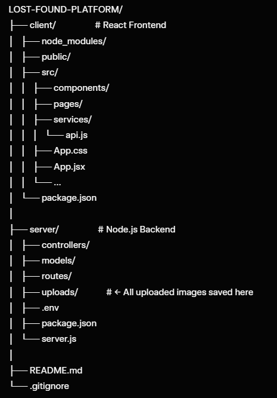

# Lost & Found Platform

A full-stack MERN web application where users can report lost items or post found items. Others can browse the listings and contact the owner directly.

Built as part of the **MERN Stack Intern Assignment**.

## ✨ Features

* Admin panel (to delete items)
* Report Lost Item (with image upload)
* Report Found Item (with image upload)
* Browse Lost & Found items (with filters and search)
* Detailed item page with full contact info
* Responsive card layout
* Local image upload (uploads/ folder)
* Clean separation of frontend & backend

## 🛠 Tech Stack

* **Frontend**: React.js, Axios, Tailwind CSS
* **Backend**: Node.js, Express.js
* **Database**: MongoDB, Mongoose
* **Image Storage**: Local (Multer)

## 📁 Actual Folder Structure 



## 2. Backend Setup

```
cd server

# Install backend dependencies
npm install

# Create .env file (copy the example below)
ADMIN_EMAIL=admin@test.com
ADMIN_PASSWORD=123456
JWT_SECRET=mysecretkey
```

## 3. Frontend Setup

```
cd ../client

# Install frontend dependencies
npm install
```

## 4. Start the Project

**Terminal 1 – Backend**

```
cd server
npm run dev          # (or node server.js if you don't have nodemon)
```

Backend will run on: `http://localhost:5000`

**Terminal 2 – Frontend**

```
cd client
npm start
```

Frontend will run on: `http://localhost:3000`

Open your browser → `http://localhost:3000`

## 🧪 Quick Test

1. Go to **Report Lost** or **Report Found**
2. Fill the form and upload an image
3. Check **Browse Items** page
4. Click any card to see full details + contact info

(Optional) Test Admin login with:

* Email: `admin@test.com`
* Password: `123456`

## 📸 Image Upload Location

All images are saved in `server/uploads/` folder.

## 🚀 Deployment Read

1. Frontend → Vercel / Netlify
2. Backend → Render / Railway
3. Database → MongoDB Atlas
4. Images → Switch to Cloudinary (optional)


